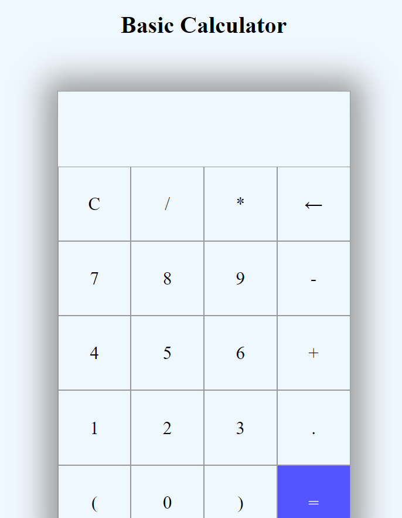

# js_calculator

A basic calculator, created with JavaScript, HTML5, and CSS3

Performs addition, subtraction, multiplication and division functions

# 11/01/2022

*Initialize repository*

TODO:

**Set up HTML file:**
- Number buttons: 0-9, and .
- Function buttons: +, _, *, /, =
- Display for input and output

**Set up CSS file**
- Link to HTML
- Align and style buttons and display

**Screenshot**

# 11/04/2022

TODO:

**Add JavaScript for functionality**
- Access elements from the DOM
- Map event listeners to buttons with switch case

**Screenshot**

# Attribution

[Create a simple calculator using HTML, CSS, and JavaScript](https://dev.to/javascriptacademy/create-a-simple-calculator-using-html-css-and-javascript-4o7k)
*by: Adam Nagy*